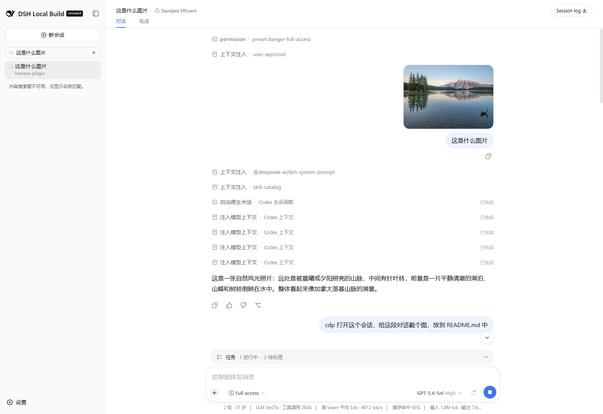
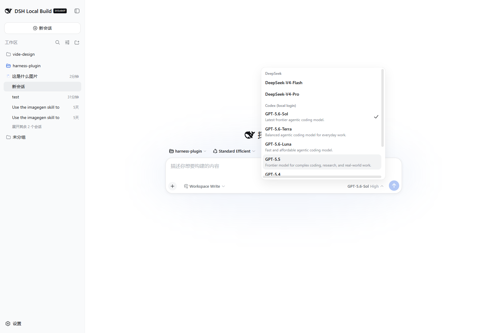
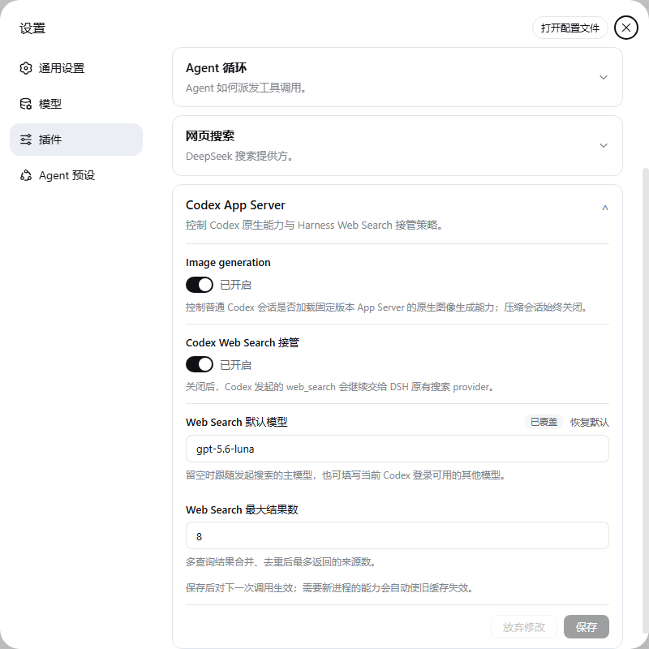

# dsh-llm-codex-app-server

English | [中文](README.zh.md)

`dsh-llm-codex-app-server` registers a DeepSeek Harness main-model provider backed by the locally authenticated Codex App Server. It is an out-of-tree Harness bundle, so installing it does not modify the `deepseek-harness` repository.

This differs from Harness's built-in `@deepseek-ai/dsh-subagent-codex`. The built-in package exposes Codex as a delegated child Agent. This package registers on `ctx.llm`, so `codex-local` is a selectable provider for the Harness Agent loop.

## Screenshot







[CDP capture log and verification details](docs/evidence/codex-settings-card.md)

## How it works

An ordinary Harness conversation session reuses one pinned `@openai/codex@0.153.3` App Server in a private empty directory and one ephemeral thread while its bounded cache lease remains valid. The process uses the native Codex account state under `CODEX_HOME`; the plugin never reads, copies, logs, or stores OAuth tokens or API keys. Requests without a session id and auxiliary requests remain one-shot.

The adapter supplies the Harness system text as App Server base instructions, reconstructs cold threads by injecting all logged Harness messages before an empty turn, declares Harness tools under the `deepseek_harness` App Server namespace, and sends later ordinary user messages through native turn input. When one DSH step appends several inbox messages, the first starts the turn and the rest enter that same turn through ordered `turn/steer` requests. The outer Harness `skill` tool is exposed there as `harness_skill`; its argument schema accepts only names from the current Harness session catalog, while Codex-native skills stay on Codex's own loader. A warm thread is reused only when the complete request is an append-only continuation the adapter can reproduce; otherwise it is discarded and rebuilt. App Server still adds Codex-owned instructions and tools. This is deliberately a layered provider, not a raw-model transport or a claim that Harness replaces the Codex prompt.

Reasoning, assistant text, usage, Codex-owned context, diagnostics, and action lifecycles are converted to Harness stream events as they arrive. Codex cached input is reported through Harness `cacheReadTokens`, so the standard token meter and conversation statistics display the cache-hit percentage without provider-specific UI. Each `codex-action` block carries a `category` (`lifecycle`, `context`, `action`, or `diagnostic`), the parsed `phase`, the exact `protocolEvent`, and its JSON protocol snapshot. Raw Code Mode calls and outcomes are included even when App Server emits no corresponding `ThreadItem`. A failed or declined Codex-native action remains an action outcome and does not fail the Harness model request unless App Server reports that the turn itself failed.

Harness user images and image-bearing tool results remain durable `ImageAttachmentRef` values in messages, replay, and cache identity. Immediately before an App Server boundary, the adapter verifies each retained attachment and transiently converts it to the protocol-specific image form: Responses `input_image` for cold reconstruction, v2 `image` input for a warm user turn, or `inputImage` for a pending dynamic-tool callback. The oldest model-visible images are replaced deterministically when their projected base64 payload exceeds `maxRequestImageBytes`; omitted images are never read. Completed Codex-native image outputs travel the opposite direction: they are decoded and committed through Harness's attachment service before publication, emitted as standard Harness `image` blocks, and replaced by small durable markers in trajectory and replay. No data URL is persisted. A chat attachment is not an implicit workspace mutation: producing `public/example.png` or another project file still requires Codex to request a declared Harness mutation tool with an explicit destination.

The package also ships a browser plugin. It shadows the stock Assistant cell at a lower slot priority, preserves the standard text, reasoning, image, and generic fallback presentations, and renders `codex-action` blocks with Harness's compact disclosure row and state dot. Image groups delegate to the current `conversation.message.images` slot; the standard Web profile composes its `ui-attachment` owner, while a custom host must compose that presentation plugin just as the stock Assistant renderer requires. The collapsed row shows the interpreted action, category, and phase; expanding it reveals the summary, exact protocol event, action id, and the durable JSON record in Harness's JSON tree. `thread/start` explicitly reports layered prompt ownership and discovered instruction-source count; it is not labeled as a Harness tool or request failure. The browser plugin also contributes a Codex App Server settings card through DSH's native `settings.plugin.item` extension point without modifying the Models or Settings core packages.

The `thread/start` block is provider lifecycle disclosure, not evidence that the model performed a native action. Codex-added developer, system, and user messages that are not part of injected Harness history appear as `context/injected` reports. They remain logged for audit but are not fed back as Harness-authored history on the next stateless request.

When App Server requests a declared tool in the `deepseek_harness` namespace, the adapter emits a real Harness `tool-call`, ends that model step, and leaves the App Server callback pending. Namespace and mapped name must both match before the call crosses into Harness; `harness_skill` additionally requires an exact current Harness catalog name and maps back to `skill` only after validation. An unnamespaced Codex-native call remains provider trajectory even when its name resembles a Harness tool; only a validated namespaced Harness call is hidden from the native-action presentation. Harness owns execution, approval, presentation, and durable logging for those calls. The next append-only request replies with the logged tool result, steers any following inbox messages into the active turn in order, and continues that same Codex turn. A replacement or other non-prefix history change forces a cold reconstruction.

Auxiliary work follows the initiating Agent's provider instead of silently switching accounts. A `compaction-basic` request with no explicit summarization route uses the selected Codex model in a one-shot process and commits only its completed text as the durable Harness checkpoint. A `web_search` call from a Codex Agent is conditionally intercepted before the configured Web provider: each query runs native live search in its own one-shot App Server process, URL citations are projected back through the existing Harness tool output contract, and every non-Codex Agent delegates to the original provider chain unchanged. Search cannot reuse the main process because that thread is waiting for the Harness tool result.

## Install

This release targets DSH `>=0.1.3-alpha.1 <0.2.0`. Its browser manifest declares the current `ui-chat` slot owner and renderer in DSH's informational client graph; the removed `dsh-client-runtime` module is not part of that roster.

Authenticate the native CLI once:

```sh
codex login
```

After a release is available from npm, install the immutable published version:

```sh
dsh plugin --profile web add dsh-llm-codex-app-server@latest
dsh --profile web --dump-config
dsh --profile web
```

To build and pack this checkout instead, first check out `deepseek-ai/deepseek-harness` at `cd5ef8148158c3a752a658978873241fdf8e2bbc` beside this repository as `../deepseek-harness`, then prepare its linked packages:

```sh
cd ../deepseek-harness
pnpm install --frozen-lockfile
pnpm run build:lib
cd ../harness-plugin
pnpm install --frozen-lockfile
pnpm run check
```

Install the generated tarball into a Harness profile:

```sh
dsh plugin --profile web add ./dist/dsh-llm-codex-app-server-<version>.tgz
dsh --profile web --dump-config
dsh --profile web
```

The bundle registers provider `codex-local` and every model shown by the pinned App Server's default picker: `gpt-6-astra`, `gpt-5.6-sol`, `gpt-5.6-terra`, `gpt-5.6-luna`, `gpt-5.5`, `gpt-5.4`, `gpt-5.4-mini`, and `gpt-5.3-codex-spark`. Select one in the Models UI. Installation does not replace the profile's default model automatically. App Server routes marked as hidden are not added to the selector.

Harness profiles set `autoInstallPeers: false`, so installation may report missing peer dependencies. At boot, the profile module fallback supplies those peers from the current Harness installation so the plugin shares its Cordis and service instances.

For source installation:

```sh
dsh plugin --profile web add github:wss534857356/dsh-plugin-codex
```

Append `#<commit>` to pin a revision. The package's `prepare` script builds TypeScript during a Git install, so pnpm must allow that package build. A packed tarball or npm release is already built.

Remove the bundle from the profile with:

```sh
dsh plugin --profile web remove dsh-llm-codex-app-server
```

## Configuration

In the Web UI, open **Settings → Plugins → Plugin configuration** and expand **Codex App Server** to edit image generation, Codex Web Search takeover, its default model, and its result cap. The card writes through DSH's `llm-codex-app-server` settings namespace. Saved values apply to the next call; a process-capability change alters the request epoch so a stale cached thread is replaced automatically.

Later profile patch layers can replace the `llm-codex-app-server` row. A replacement must restate the complete config because Harness patch rows do not deep-merge.

| Key | Default | Meaning |
|---|---:|---|
| `provider` | `codex-local` | Harness provider route. |
| `displayName` | `Codex (local login)` | Selector label. |
| `modelProvider` | `openai` | Codex App Server model-provider id. |
| `models` | Eight visible App Server catalog entries | Advisory model metadata, input modalities, and reasoning choices. The shipped snapshot declares image input for seven routes and text-only for Spark; omitted/custom modalities default to text-only. Unlisted safe model ids remain routable as text-only. |
| `timeoutMs` | `300000` | Wall-clock limit for one App Server turn. |
| `disposeGraceMs` | `3000` | Process-tree termination grace. |
| `maxJsonRpcLineBytes` | `8388608` | Maximum bytes accepted from App Server stdout for one newline-delimited JSON-RPC message. Parsed messages do not count toward a cumulative stdout limit. |
| `maxRequestImageBytes` | `20971520` | Maximum projected base64 image payload hydrated into one model request; oldest model-visible images become deterministic omission text first. |
| `maxStderrBytes` | `65536` | Maximum retained diagnostic output. |
| `maxRetries` | `1` | Harness-visible retries for transient process or provider failures. A model-capacity rejection waits five minutes, then retries the original model without rerouting. |
| `maxCachedSessions` | `8` | Maximum idle or tool-waiting session leases retained before least-recently-used eviction. Active requests may temporarily exceed it. |
| `sessionIdleTimeoutMs` | `600000` | Idle lifetime of a cached App Server session thread. |
| `imageGenerationEnabled` | `true` | Whether ordinary model turns enable native image generation in the pinned App Server. Compaction turns always keep it off. |
| `webSearchEnabled` | `true` | Whether this provider conditionally takes over its agents' `web_search` calls; disabling it delegates to the existing DSH Web provider chain. |
| `webSearchModel` | follow main model | Plugin-owned search-only model override. Blank uses the initiating Codex model; official Codex config exposes no separate Web Search model key. |
| `webSearchMaxResults` | `8` | Source cap applied after conditional Codex-native searches are merged. |
| `env` | `{}` | Explicit child environment layered over Harness's scrubbed parent environment. Use this to pass `CODEX_HOME` when it is nonstandard. |

Example override:

```yaml
- id: llm-codex-app-server
  name: dsh-llm-codex-app-server
  config:
    provider: codex-local
    displayName: Codex (local login)
    modelProvider: openai
    models:
      - id: gpt-6-astra
        name: GPT-6-Astra
        contextWindow: 1050000
        inputModalities: [text, image]
        reasoningEfforts: [low, medium, high, xhigh, max, ultra]
        defaultReasoningEffort: medium
    timeoutMs: 600000
    disposeGraceMs: 3000
    maxJsonRpcLineBytes: 8388608
    maxRequestImageBytes: 20971520
    maxStderrBytes: 65536
    maxRetries: 1
    maxCachedSessions: 8
    sessionIdleTimeoutMs: 600000
    imageGenerationEnabled: true
    webSearchEnabled: true
    webSearchModel: gpt-5.4-mini
    webSearchMaxResults: 8
    env:
      CODEX_HOME: !!js process.env.CODEX_HOME
```

## Compatibility and limitations

- The protocol baseline is Codex CLI `0.153.3`; the dependency and runtime handshake are pinned because the experimental App Server protocol is version-sensitive.
- The default catalog exposes each model's full context window: `1050000` for GPT-6 Astra, GPT-5.4, GPT-5.5, and the GPT-5.6 family; `400000` for `gpt-5.4-mini`; and `128000` for `gpt-5.3-codex-spark`. The pinned App Server may report a smaller effective working window in usage notifications. A deployment that enforces that smaller limit can override model metadata; a provider-confirmed context overflow remains eligible for Harness compaction and retry.
- The default model catalog is a dated `model/list` snapshot observed on 2026-09-05 with App Server `0.153.3`: GPT-6 Astra, GPT-5.6 Sol/Terra/Luna, GPT-5.5, GPT-5.4, and GPT-5.4 Mini declared text+image input; GPT-5.3 Codex Spark declared text only. The server/account catalog may change independently of the package, so every Codex upgrade must re-probe it. Custom entries without `inputModalities` and unlisted ids remain text-only.
- Codex co-owns the model-visible instructions and tool catalog. The keyless wire test records the extra permission, primary-agent, collaboration, environment, interaction, and code-mode layers that remain after supported thread overrides.
- Code Mode remains enabled because `gpt-5.6-sol` uses it to dispatch App Server dynamic tools. Native image viewing stays enabled; image generation defaults on for ordinary turns but can be disabled in the plugin settings card, and remains off for compaction and search processes. This image-generation switch is a capability flag of the pinned App Server `0.153.3`, not a stable top-level Codex configuration key. Unrelated optional native integrations remain disabled.
- Image input, image-bearing tool results, and native generated images require the profile's durable `ctx.attachments` service. Image bytes are subject to its media, byte, count, aggregate-byte, pixel, and side-dimension limits and are never stored inline in messages, `codex-action` blocks, or replay state.
- Native Codex actions may still occur. They run in a private empty working directory under a read-only sandbox with approvals set to `never`; their lifecycle snapshots are displayed as provider trajectory, and approval or interaction requests are safely declined unless the protocol can answer them without user authority.
- Discovered instruction sources are shown in the `thread/start` lifecycle report. A non-empty report is disclosure, not a request failure. Codex-generated context that is absent from this list is reported separately as `context/injected`.
- Models that affirmatively declare `image` accept ordered image-only or mixed text/image user prompts and image-bearing Harness tool results. Text-only, unavailable, custom-without-declaration, and uncatalogued routes reject image history before process startup.
- `temperature` and `stop` are rejected because App Server `0.153.3` exposes no reliable equivalents. `maxTokens` is also rejected for ordinary and session-title requests. For `purpose: compaction` only, the adapter accepts it as an advisory Harness budget, removes live tool declarations, and waits for a naturally completed Codex summary; App Server cannot enforce the numerical cap.
- App Server automatic compaction is configured at Harness's safe integer ceiling so the durable Harness summary replaces logged history first. Any native compaction item or notification still makes the live lease non-reusable and is never written into reconstructible replay state. Leave `compaction-basic.summarizationProvider` and `summarizationModel` unset to follow the Agent's selected Codex route.
- A Codex-initiated `web_search` uses native live Codex search in isolated one-shot processes and returns only citeable HTTP(S) sources. It follows the initiating Agent's model unless the plugin card sets a search-only override. When takeover is disabled, and for every non-Codex Agent, the conditional around-dispatch listener calls `next()` unchanged, so installing the bundle neither removes nor duplicates the existing Web provider implementation.
- `CODEX_INTERNAL_ORIGINATOR_OVERRIDE=deepseek-harness` identifies adapter requests; this internal compatibility point is reverified on Codex upgrades.
- Session-scoped threads are in-memory disposable caches. The Harness log and adapter replay state reconstruct model-visible history after process restart, plugin reload, expiry, eviction, compaction, fork, repair, retry mismatch, or any changed request epoch; Codex rollout files are never resumed.
- Harness rc.8 stores adapter replay inside `ReplayEnvelope.response`; the plugin still accepts pre-envelope version-4 sessions. Replay state version `4` contains only provider outputs in `items`, while observed Codex-owned context stays in `contextItems` for audit and is never reinjected. User/tool/generated image payloads use durable attachment markers. Cold rebuild hydrates retained provider-visible markers; a warm continuation hydrates only appended user or tool-result content. Harness calls retain their `deepseek_harness` namespace and mapped App Server name. Reconstruction coalesces cumulative snapshots by stable provider item or call identity, drops any unpaired Code Mode custom call/output that a fresh process cannot resume, and falls back to Harness message reconstruction for older replay versions.
- Authentication and subscription availability belong to the native Codex installation. Login failures surface as Harness `AUTH` failures; the plugin provides no credential UI.

## Development

See [Build and release](docs/releasing.md) for the cross-platform CI matrix, npm package guard, first-publication bootstrap, trusted-publisher setup, and version-tag procedure.

The raw-transport claim was rejected in [ADR 0001](docs/adr/0001-use-app-server-as-a-harness-owned-transport.md) after the [provider investigation](docs/app-server-provider-plan.md) captured Codex-owned instructions and tools on the outbound request. [ADR 0002](docs/adr/0002-use-app-server-as-a-layered-codex-provider.md) accepts the implemented ownership split. [ADR 0003](docs/adr/0003-separate-codex-trajectory-from-harness-tools-and-replay.md) records how raw actions, provider context, replay, and Harness tool calls remain distinct. [ADR 0004](docs/adr/0004-render-codex-trajectory-in-the-browser-plugin.md) records the client renderer shadow used by the out-of-tree bundle. [ADR 0005](docs/adr/0005-coalesce-stateless-codex-replay.md) bounds cold replay reconstruction by provider identity. [ADR 0006](docs/adr/0006-reuse-disposable-session-threads.md) defines exact session continuation and disposable cache ownership. [ADR 0007](docs/adr/0007-namespace-harness-dynamic-tools.md) makes the App Server namespace the tool-ownership label. [ADR 0008](docs/adr/0008-retain-native-image-tools.md) keeps the native image tools required by Codex's image skill. [ADR 0009](docs/adr/0009-externalize-native-generated-images.md) records durable generated-image projection. [ADR 0010](docs/adr/0010-bridge-durable-image-input.md) defines marker-based image input, bounded hydration, and truthful modality advertisement. [ADR 0011](docs/adr/0011-follow-codex-for-auxiliary-work.md) makes compaction and web search follow the initiating Codex route without changing non-Codex tool execution.

```sh
pnpm run typecheck
pnpm run test
pnpm run build
pnpm pack --pack-destination dist
```

Unit and wire tests require no account. With `codex login` already completed, run the real local-login round trip:

```sh
pnpm run test:e2e
```

The real test loads the Harness LLM and local-subprocess providers, completes a Harness tool round trip, ordinary follow-up, and durable image-input turn on one cached App Server thread, records any provider cache evidence without requiring nondeterministic cache accounting, and verifies process-tree quiescence after plugin disposal.
